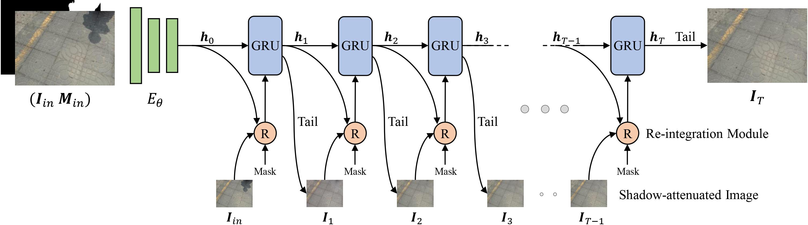

# PRNet
Progressive Recurrent Network for shadow removal. CVIU 2023




### Datasets

In this paper, we utilize ISTD, ISTD+, SRD and SBU-TimeLapse datasets. You can download them from ISTD [[link]](https://github.com/DeepInsight-PCALab/ST-CGAN), ISTD+ [[link]](https://github.com/cvlab-stonybrook/SID), SRD [[Training]](https://drive.google.com/file/d/1W8vBRJYDG9imMgr9I2XaA13tlFIEHOjS/view)[[Testing]](https://drive.google.com/file/d/1GTi4BmQ0SJ7diDMmf-b7x2VismmXtfTo/view), SBU-TimeLapse [[link]](https://github.com/cvlab-stonybrook/SID)

### Training

the data structure should be like this:

```
|-- ISTD_Dataset
    |-- train
        |-- train_A # shadow image
        |-- train_B # shadow mask
        |-- train_C # shadow-free GT
    |-- test
        |-- test_A # shadow image
        |-- test_B # shadow mask
        |-- test_C # shadow-free GT
```

modify your data path in `cfg/1.yaml` and run

```python
python train.py
```

### Testing

modify your test data path in `cfg/1.yaml` and run `python test.py`. The results will be saved in `results` folder.

We provided the qualitative results of [istd](https://pan.baidu.com/s/1OrSG0UcDSK1GxVH8lepbjQ), [aistd](https://pan.baidu.com/s/1dK90noYDdIxp8j05ih5_Vg), and [srd](https://pan.baidu.com/s/1y9f4qi5jS2dbpY8eLHJImQ) here, (code:gxqt).

### Evaluation
Following the previous paper, the results reported in this paper are calculated by the matlab script used in [previous method](https://github.com/zhuyr97/AAAI2022_Unfolding_Network_Shadow_Removal/tree/master/codes). You can refer to `evaluation` folder for more details.

### Citations

```
@article{wang2024progressive,
  title={Progressive Recurrent Network for shadow removal},
  author={Wang, Yonghui and Zhou, Wengang and Feng, Hao and Li, Li and Li, Houqiang},
  journal={Computer Vision and Image Understanding},
  volume={238},
  pages={103861},
  year={2024},
  publisher={Elsevier}
}
```

### Contact
If you have any questions, please contact me wyh1998@mail.ustc.edu.cn